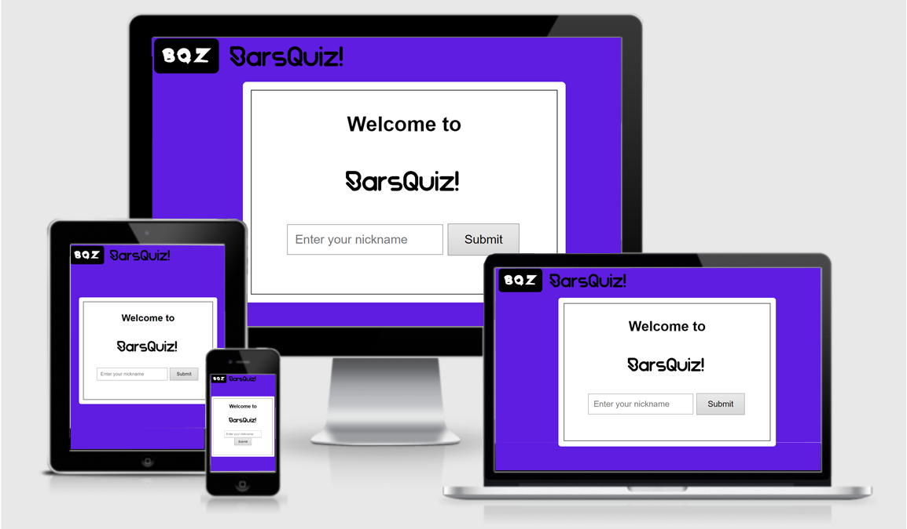
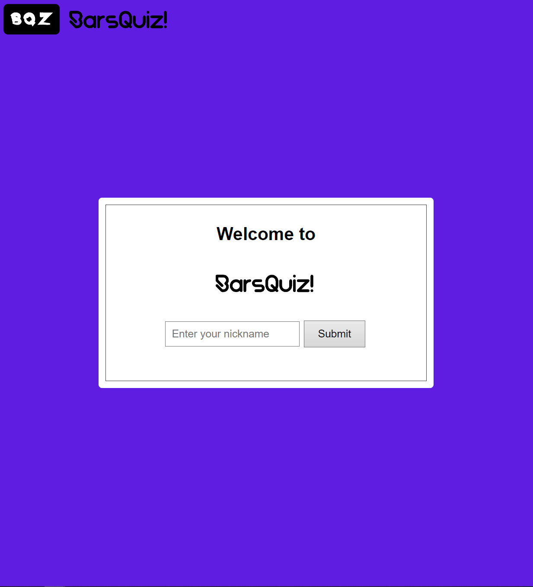
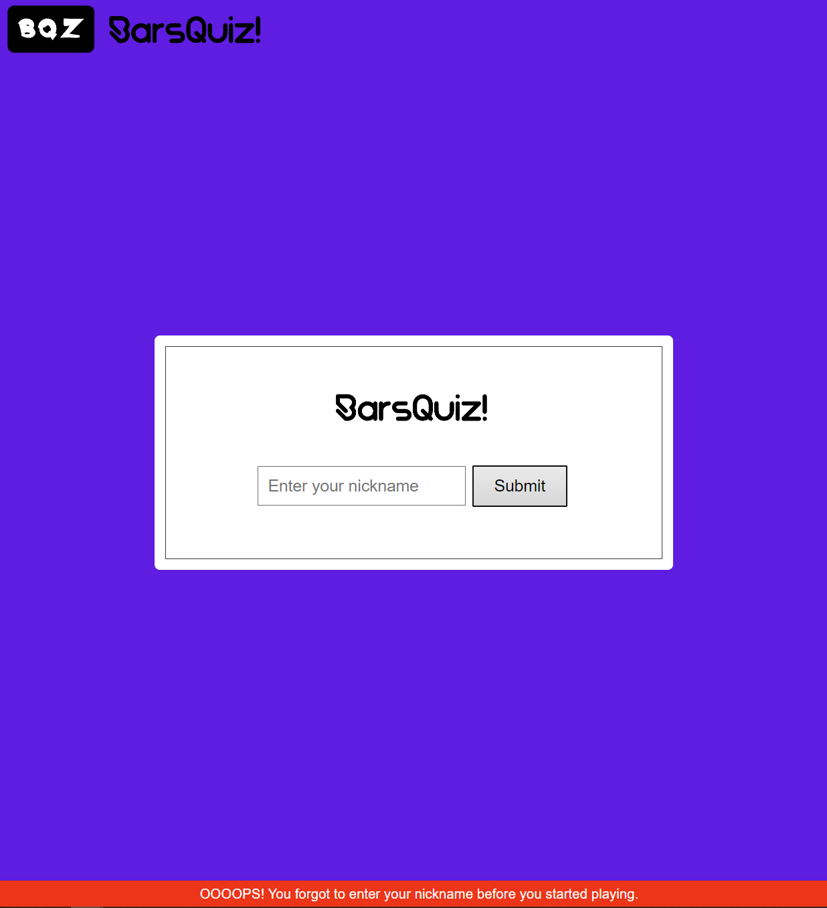
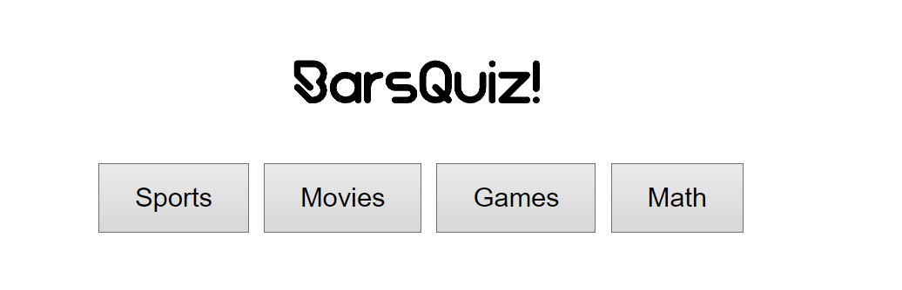
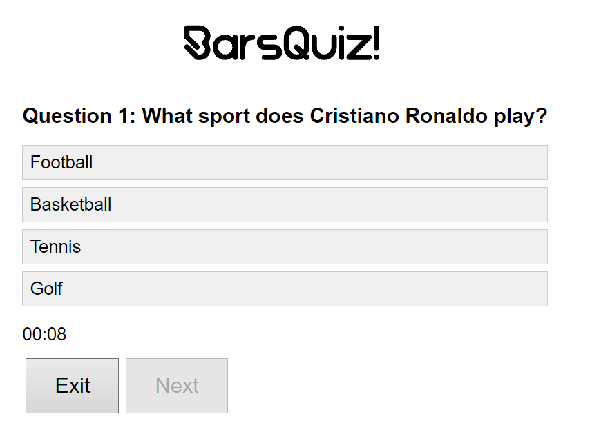
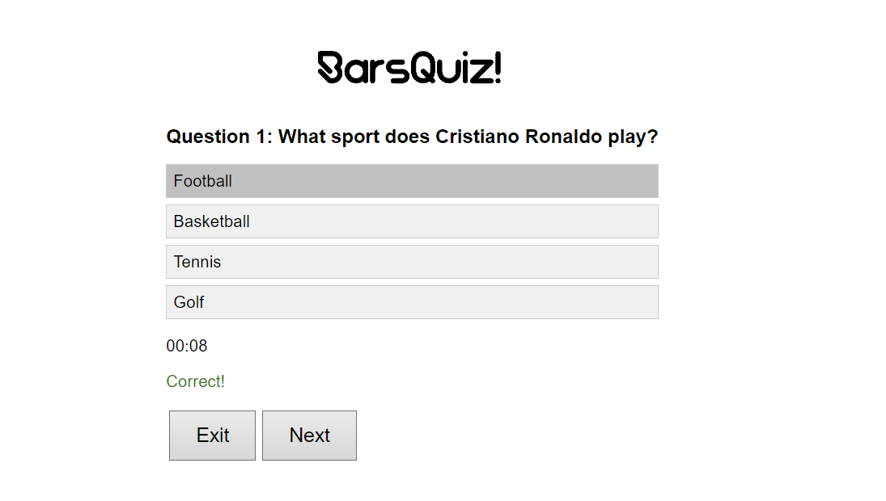
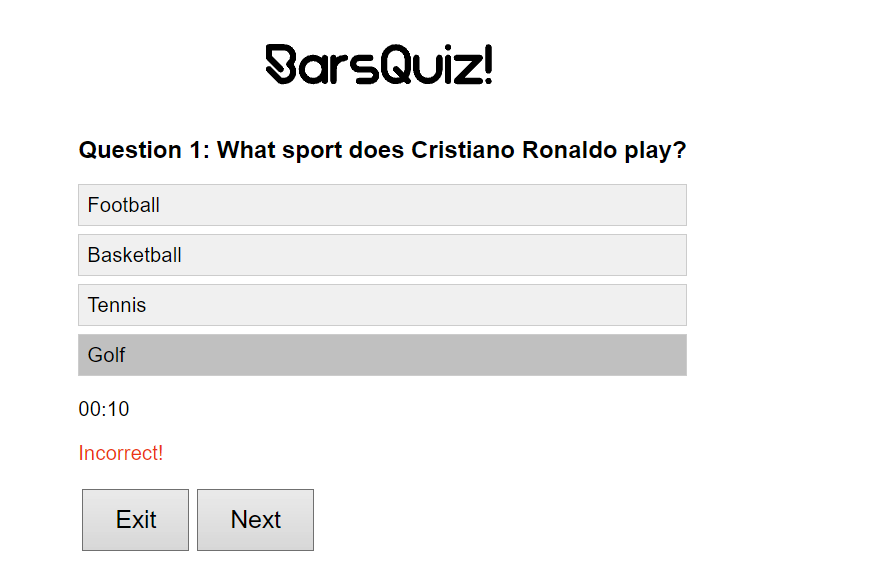
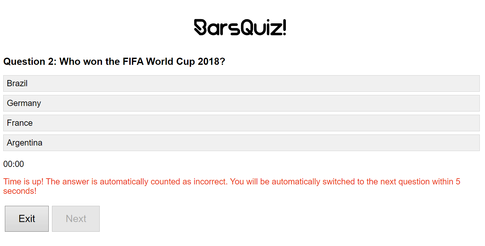
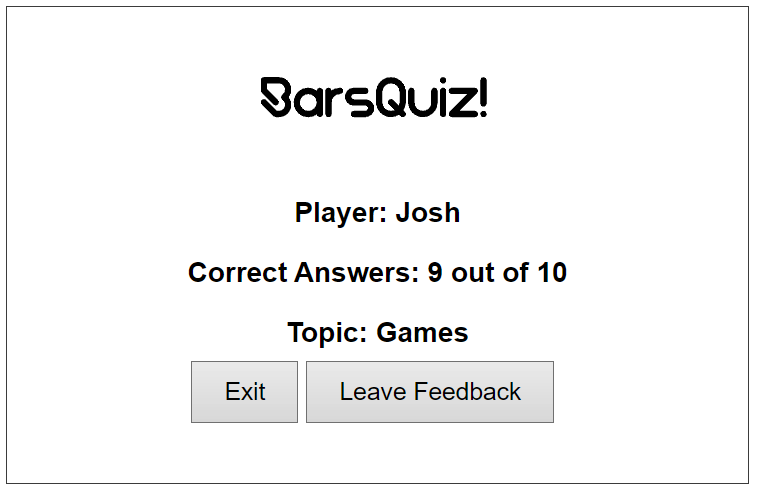
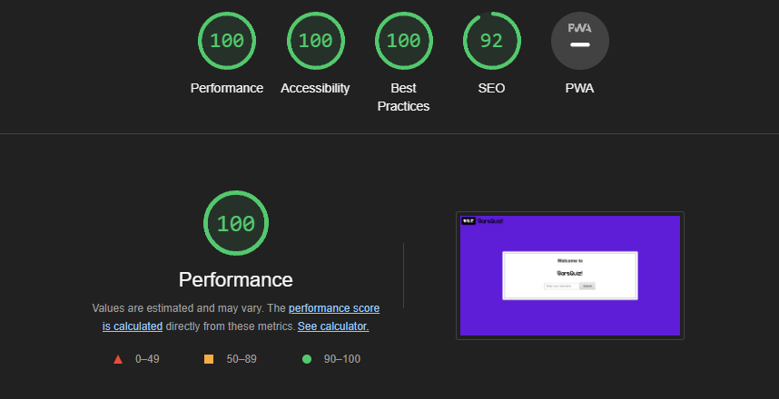

# BarsQuiz
BarsQuiz is a game that will help you, or you and your friends/colleagues or family members, spend time playing together in an entertaining and informative way. When you go to the site, you have the opportunity to write your “nickname”, after which you can select any topic from the list, such as “Sports, Movies, Games, Math”, each of these topics has 10 different questions associated with one of these topics, as well as 4 answer choices of which only 1 is correct. But also during this game you only have 10 seconds to choose an answer, which means that you have a limited time for each question.

Users of this game can find out how well they know each topic (optional), which may have different questions with each topic. This site will be aimed at both adults and children, and will become a simple application for practice and entertainment, it can also be for learning, if a person does not know the answers, he can check which is correct (this will only show when choosing the correct answer, in order so that a person would try to guess which one is correct without writing down the answers somewhere in a notebook and the like)

## Features
### Existing features
- Header
    - In the middle of the page where all the content is located, the title of the game “BarsQuiz” is indicated in the game font.
    - This title clearly tells the user what game they are currently playing.

        

- Main page
    - On the main page the user is given the opportunity to write his nickname.
    
    - If the user has not written a nickname, the system warns about this by showing a message at the bottom.
    

- Game Options
    - User can select any topic from the list, such as “Sports, Movies, Games, Math”
    
    - After selecting the topic, the user will be presented with 10 questions, each of which has 4 answer choices of which only 1 is correct. But also for each answer you are given 10 seconds to choose an answer. 
    
    - After selecting an answer, the user will be shown whether he answered correctly or not. But if you choose the wrong answer, the correct answer itself will not be shown, so that a person can personally guess, or personally find out the answer to a particular question, and thereby interest the person.
    
    
    - If within 10 seconds the user does not have time to select an answer, the system will automatically write a message just below in red.
    
- The Game Results(Scoreboard)
    - After finishing the game, the user will be presented with a scoreboard, which will show the user how well they know each topic.
    - The JavaScript code automatically calculates the correct answers that were selected by the user from all 10 questions and in the Scoreboard shows the user's nickname that was written at the very beginning, the number of correct answers out of 10, and what topic was selected
    

- Feedback
    - The user can write his feedback about the game, this feedback will be sent to the developer.
    
## Features Left to Implement
- When there is time, I would like to add new topics and questions (with images) for this game.
## Testing
- I tested the game on the following browsers: Opera, Chrome, Microsoft Edge.
- I tested the game on the following devices: Laptop, Desktop, Mobile.
- I confirmed that the game works properly on all the devices and browsers.
-  I confirmed that header, options, results, feedback, and questions are working properly.
- I confirmed that the colors and fonts chosen are easy to read and accessible by all users.

- I confirmed that project is responsive, looks good and functions on all devices/screens.
## Bugs
### Solved bugs
- When I wrote JavaScript code to check the answer in a question, and so that the “Next” button would work only after the answer, there was a bug that the “Next” button would not work at all. The code was completely changed to a different one, I consulted with a friend who is more versed in JavaScript coding, and helped me solve it.
- Removing the starting/fixed the problem.
## Unfxied Bugs
No unfixed bugs.
## Validator Testing
- HTML
    - No errors were returned when passing through the official [W3C validator](https://validator.w3.org/#validate_by_uri).
- CSS
    - No errors were returned when passing through the official [W3C CSS Validator (Jigsaw)](https://jigsaw.w3.org/css-validator/).
- JavaScript
    - No errors were returned when passing through the official [JSHint JavaScript Validator](https://jshint.com).
## Deployment
- The site was deployed to GitHub pages. The steps to deploy are as follows:
    - In the GitHub repository, navigate to the Settings tab
    - From the source section drop-down menu, select the Master Branch
    - Once the master branch has been selected, the page provided the link to the completed website.

The live link can be found here - [BarsQuiz](https://barsllvl.github.io/barsquiz/).
## Credits
### Content
- Code for fixing footer, setting timer, adding function taken from [w3schools](https://www.w3schools.com) and [freeCodeCamp](https://www.freecodecamp.org).
### Media
- To create my logo I used [myfreelogomaker](https://myfreelogomaker.com).
